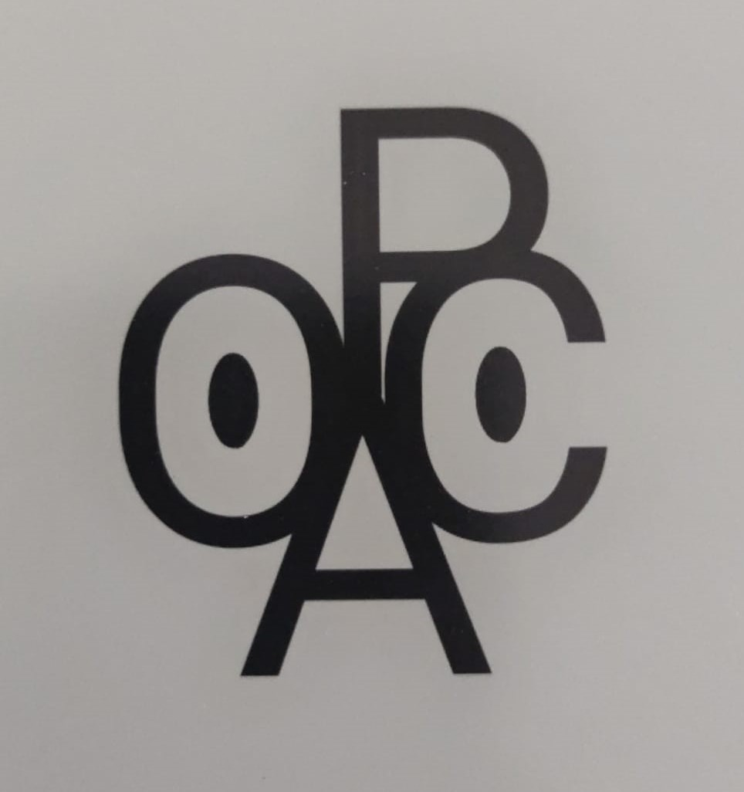

# Guião de entrevista (INTRO)

# Computational Creativity for Your Needs

Podemos gravar esta entrevista?

Já preencheste o consentimento informado?

## Apresentações

### Investigadores Responsáveis

Luís Espírito Santo (UC2021208173) - les@student.uc.pt

André Carvalho dos Santos (UC2021144340) - [andresantos@dei.uc.pt](mailto:andresantos@dei.uc.pt)

Marcio Lima Inácio (UC2021183381) - [mlinacio@dei.uc.pt](mailto:mlinacio@dei.uc.pt)

| Módulo | Cadeira | Progama | Centro | Departamento | Universidade |
| --- | --- | --- | --- | --- | --- |
| Métodos Qualitativos | Métodos de Investigação  | Doutoramento em Engenharia Informática | Centro de Informática e  Sistemas da Universidade de Coimbra (CISUC) | Departamento de Engenharia Informática (DEI) | Universidade de Coimbra |

## Questões de Controlo

- Demográficas
    - **QUESTÃO:** Com que género te identifica (ou preferes não dizer)?

    - **QUESTÃO:** Qual a tua idade (ou preferes não dizer)?

    - **QUESTÃO:** Em que país/região vives atualmente? Em que outros países/regiões já viveste?

- Ocupação
    - **QUESTÃO:** Qual a tua formação?

    - **QUESTÃO:** Qual a tua ocupação profissional?

    - **QUESTÃO:** Qual a tua relação com as tecnologias (telefone, computador, smartphone...)?

- Criatividade
    - **QUESTÃO:** Com que áreas criativas tens contacto regular?

    - **QUESTÃO:** Poderias providenciar alguns exemplos de atividades que em geral consideras criativas?

    - **QUESTÃO:** Com que frequência consideras que tens contacto com atividades criativas e quais?
        - Mais especificamente sobre as que realizas?
        - Mais especificamente sobre as que consomes?

    - **QUESTÃO:** Qual o papel das tecnologias nas atividades criativas com as quais tens contacto?

    - **QUESTÃO:** Antes deste estudo já conhecias o termo Criatividade Computacional (ou Computational Creativity)?
        - Se sim, onde ouviste antes?
        - Podes tentar explicar por palavras tuas?

## Propósito do Estudo

Na área da **Criatividade Computacional (CC)** pretende-se modelar, simular ou replicar criatividade usando um computador, de forma a alcançar um de vários fins:

- construir um programa ou computador capaz de criatividade de nível humano;
- melhor compreender a criatividade humana e formular uma perspetiva computacional sobre o comportamento criativo em humanos;
- conceber programas que possam enaltecer a criatividade humana sem necessariamente que estes sejam criativos eles próprios.

Nós acreditamos no entanto que a integração das ferramentas e software desenvolvido em **CC** na sociedade tem sido negligenciada e que mais importância deve ser dada a este fator.

Nesse sentido é então claro a importância de compreender as necessidades e expectativas de diferentes grupos para a área.

Com isto em mente, o objetivo principal deste estudo é investigar junto de inventores/inventoras, criadores/criadoras, e artistas os seus sentimentos, necessidades, desejos e expectativas para a área de **Criatividade Computacional**, através de casos hipotéticos e analogias.

## Fases da Experiência

1. **Entrevista de Introdução  (30-60 min)** ✅
2. **Interação com o POCA (1 semana)**
3. **Entrevista de Conclusão (30-60 min) 👋**

## O que é o POCA?

## O POCA, o *pocket artist*, vai ser o teu companheiro durante uma semana **e ele pode ser o que quiseres que ele seja**!

## Como pode o POCA ajudar-te?

💡 **É isso que pretendemos estudar!**

1. Como poderia uma Máquina Criativa ajudar-te?
2. Como poderia uma máquina ajudar-te a ser mais criativo?

## Regras

- O **POCA** não vai responder às tuas necessidades 😢
- A comunicação com o **POCA** será feita apenas pelo WhatsApp
    - Podes enviar audios, textos, fotos, videos, ou até combinações destas
    - Se o **POCA** respondesse também só poderia utilizar os mesmos recursos
- Quando interages com o **POCA** deves dar o máximo de contexto que conseguires:
    - Onde estavas?
    - O que fazias?
    - O que te motivou a interagires com o **POCA**?
    - O que farias com o resultado?
    - Porque te lembraste de utilizar o **POCA**?
    - ...
- Dentro destas regras podes interagir com o **POCA como tu quiseres** e **sempre** **que necessitares** durante o teu dia-a-dia!

## Contacto

# **DIZ OLÁ AO** POCA **[TELEPHONE NUMBER]!**

## Primeira Interação

## VAMOS TENTAR?

Pensa numa das atividades que referiste no início da entrevista...

⚠️ **TENTA ISTO EM CASA!** 😁

## Questões?

## Notas Finais

- Data da reunião final (daqui a uma semana?) 📅
- Irás receber um e-mail de follow-up que serve de resumo desta entrevista 📧
- Quaisquer dúvidas podes sempre falar connosco por qualquer meio que te der mais jeito! 😁

---

